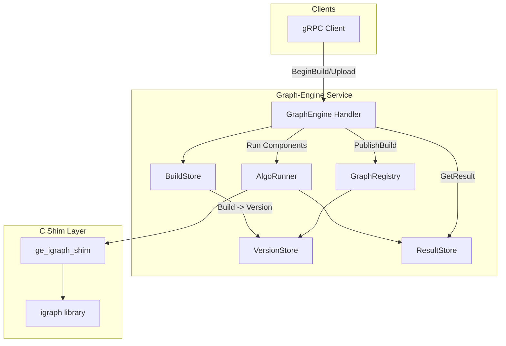
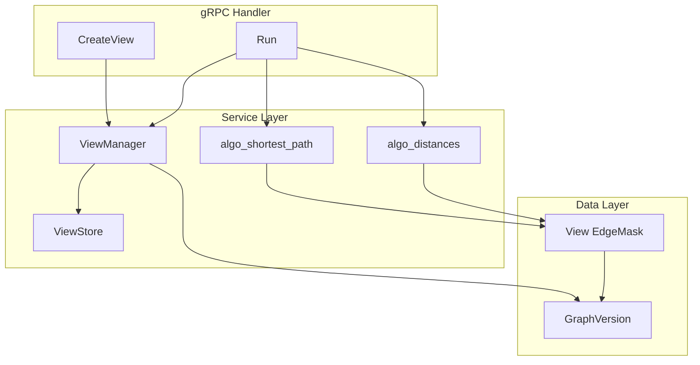
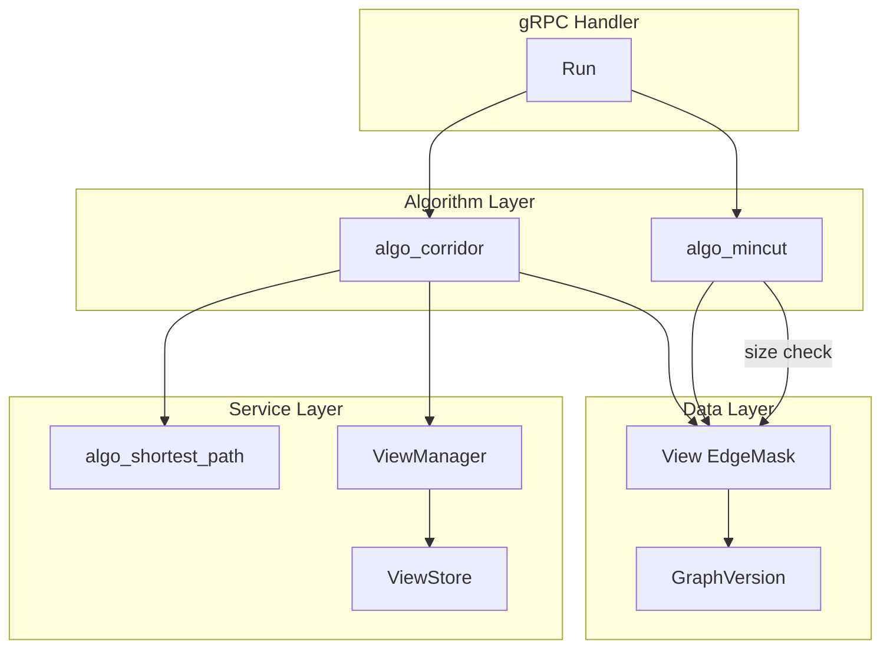
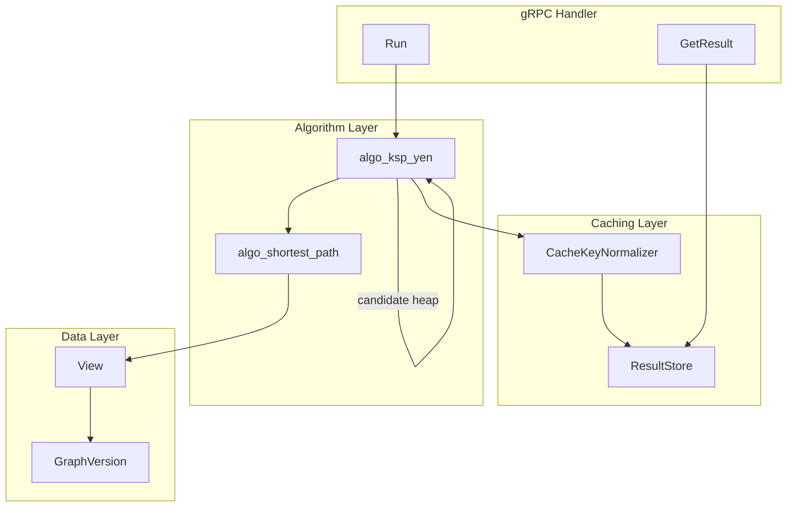
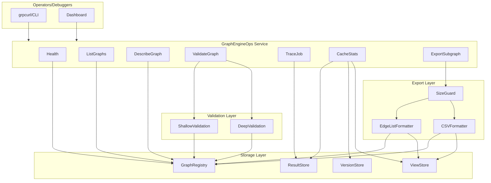
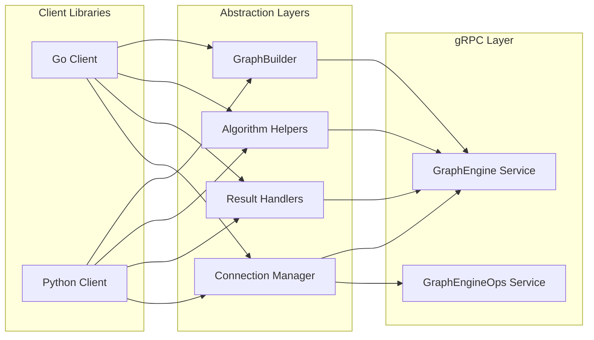

# Graph-Engine (Go + gRPC) built on igraph — Design Doc (Markdown)

**Audience:** engineers building and consuming a stateful “graph-engine” service  
**Status:** proposal (canonical API, minimal cgo surface)  
**Last updated:** 2026-01-28

> **Licensing note (not legal advice):** igraph is GPL-2.0-or-later. A network service approach avoids *client-side* linking to GPL code. If you distribute the server binary to customers, you still need to comply with GPL obligations for that distributed program. See **References**.

---

## Contents

1. [Motivation and high-level requirements](#1-motivation-and-high-level-requirements)  
2. [High-level design](#2-high-level-design)  
3. [Data structures](#3-data-structures)  
4. [gRPC proto definitions](#4-grpc-proto-definitions)  
5. [cgo bindings design (C shim + Go wrappers)](#5-cgo-bindings-design-c-shim--go-wrappers)  
6. [Go and Python client libraries](#6-go-and-python-client-libraries)  
7. [Phased approach (baby steps) with TODOs](#7-phased-approach-baby-steps-with-todos)  
8. [Troubleshooting APIs](#8-troubleshooting-apis)  
9. [References](#references)

---

## 1. Motivation and high-level requirements

### 1.1 Motivation

- **Avoid GPL “pollution” in clients:** clients talk to a network service over gRPC; they do not link against igraph.
- **Distributable to customers:** the graph-engine server may be shipped to customers, so the server code must be **canonical** (not customer-specific) and support configuration rather than bespoke logic.
- **Reduce binding surface:** avoid a 1:1 igraph API. Provide a **small, stable, high-level API** and keep cgo entrypoints coarse-grained.

### 1.2 Requirements (functional)

- **Stateful**: multiple graphs loaded and kept across calls.
- **Versioning / updates**: periodic “owner” client can load/update and run batch analytics; publish new versions.
- **Parallel reads**: many clients can query the **same** graph/version concurrently:
  - extract subgraph views
  - traversal / neighborhood
  - shortest path and k-shortest paths (Yen)
  - corridor across communities, cuts / s-t mincut (usually on corridor view)
- **Long-lived results**: communities and certain results can persist (handles, TTL/LRU, pinning).

### 1.3 Requirements (non-functional)

- **Scale target**: ~200K nodes, ~1M edges (per graph), potentially multiple graphs.
- **Fast**: prioritize low latency and predictable tail behavior.
- **Memory-aware**: avoid per-edge per-node object overhead; prefer flat arrays and compact representations.
- **Concurrency safety**: correctness under concurrent access is non-negotiable.
- **Operability**: observability, introspection, and “explainability” for paths/cuts.

---

## 2. High-level design

### 2.1 Core architectural choices

#### A) Immutable snapshot versions + atomic publish (recommended)
- Treat each update as building a **new immutable snapshot** (a new igraph instance).
- Readers run on a specific version; no in-place mutation.
- Publishing swaps `graph_name -> current_version` atomically.
- Old versions are freed after refcount drops to zero (or TTL expires).

Benefits:
- Readers never block on updates.
- Result correctness is easier (cache keys include version).
- A good fit for “one writer periodically, many concurrent readers.”

#### B) Concurrency model for igraph calls
igraph thread-safety depends on how it is built (TLS enabled, dependencies thread-safe). To stay safe:
- **Default**: per-version **semaphore** limiting concurrent algorithm executions (e.g., 1–4 at a time).
- **Fallback**: serialize igraph calls per version (actor-style) if thread-safety is uncertain.
- **Config flag**: `max_parallel_igraph_calls_per_version` (start at 1; increase after validation).

### 2.2 Components

| Component | Responsibility | Notes |
|---|---|---|
| **GraphRegistry** | Tracks graphs, versions, and handles | Map `(graph_name)` → current `GraphVersionHandle` |
| **Builder** | Builds new graph versions (full or delta) | Background build + validation + artifact batch run |
| **VersionStore** | Owns version objects and refcounts | RCU-style pin/unpin for readers |
| **ViewManager** | Constructs “views” (subgraphs) from filters | Avoid exposing igraph selectors |
| **AlgoRunner** | Executes algorithms (igraph or custom) | Returns typed ResultHandles |
| **ResultStore** | Stores results (TTL/LRU, pinning) | Keyed by `(graph_version, algo, params)` |
| **Scheduler** | Fairness & cancellation | Prevent a single client from starving others |
| **Ops/Debug** | Stats, tracing, validation, exports | Built-in troubleshooting APIs |

#### Architecture Diagram




### 2.3 Canonical API approach (“few verbs, rich specs”)

Avoid 1:1 igraph calls. Use a small set of verbs:
- **Upload / Build / Publish**
- **CreateView**
- **RunAlgo**
- **GetResult (streaming)**
- **Release handle**
- **Ops / Troubleshooting**

All complexity moves into:
- `ViewSpec` (filters and subgraph construction)
- `AlgoSpec` (algorithm kind + params)

### 2.4 “Not exposing how clients use igraph”
Clients see canonical domain-agnostic concepts:
- graphs, versions, views
- components/communities, shortest paths, k-shortest paths, s-t mincut
- neighborhoods, BFS
They do **not** see igraph-specific attribute APIs, eids, selectors, or subgraph primitives.

---

## 3. Data structures

### 3.1 Identity

- **NodeId**: `uint64` (or string externally, but normalize to `uint64` internally).
- **EdgeId**: optional stable `uint64` if you need persistent edge handles; otherwise edge identity is `(src,dst,kind,attrs)`.

Recommendation: accept both at ingestion:
- `node_id: uint64`
- `edge_id: uint64` (optional; if omitted, engine assigns)

### 3.2 Canonical columns (columnar attributes)

Avoid per-edge objects. Store typed columns aligned with edge/vertex indices:

- Vertex columns: `partition_id:uint32`, `is_portal:bool`, `site_id:uint32`, etc.
- Edge columns: `kind:uint16`, `weight:float32`, `tenant:uint32`, `tags:uint32[]` (optional), etc.

Implementation:
- `VertexCols` contains `[]uint32`, `[]bool`, `[]float32`…
- `EdgeCols` contains `[]uint16`, `[]float32`, `[]uint32`…

Keep igraph attributes minimal; pass weights to igraph via arrays when needed.

### 3.3 Node ID mapping

During build:
- Use a transient map `map[uint64]uint32` for `node_id -> compact_index`.
- After build, freeze:
  - `index_to_node_id []uint64`
  - (optional) keep the map for fast lookups, or rebuild a compact open-addressing table if memory pressure requires.

For ~200K nodes, a Go map is usually fine as a starting point; optimize later if needed.

### 3.4 Views

A **view** is a filtered subgraph of a specific version.

Represent views as:
- `EdgeMask`: roaring bitmap or bitset over edge indices, plus optional vertex mask.
- Or store a precomputed list of edge indices for “small” views.

View building strategy:
- Use indexes by `kind`, `partition_id`, etc. (precomputed bitmaps per value or range).
- Combine masks using AND/OR/NOT.

When running an algorithm on a view:
- Either:
  - build an igraph subgraph in the C shim (from edge list), or
  - keep multiple pre-built igraph graphs for common “kinds” (e.g., PHYSICAL-only) if worth it.

### 3.5 Results

Return results as **flat arrays** (zero per-element overhead), streamable:

- Components / communities: `membership[]uint32` (len = vcount)
- Shortest path: `path_vertices[]uint32` or `path_edges[]uint32`, plus `total_cost`
- K shortest paths: `offsets[]uint32` + `vertices[]uint32` (ragged array encoding) + `costs[]float64`
- s-t mincut:
  - `cut_value`
  - `partition[]bool` per vertex (or list of vertices/edges in cut)
- Neighborhood/BFS: `visited_vertices[]uint32`, optional parent arrays.

Store results in `ResultStore`:
- keyed by `(graph_version, algo_kind, params_hash, view_hash)`
- TTL + size limits + pinning

---

## 4. gRPC proto definitions

> This proto is designed to be **stable and canonical**. Add new algorithms by extending `oneof` specs and result unions.

```proto
syntax = "proto3";

package graphengine.v1;

option go_package = "github.com/yourorg/graphengine/gen/graphengine/v1;gepb";

import "google/protobuf/timestamp.proto";
import "google/protobuf/duration.proto";
import "google/rpc/status.proto";

// -------------------------
// Core services
// -------------------------

service GraphEngine {
  // Upload a full graph as a new build, returning a build_id.
  // Client then calls PublishBuild to make it "current".
  rpc BeginBuild(BeginBuildRequest) returns (BeginBuildResponse);

  // Stream vertices/edges/columns into a build.
  rpc Upload(stream UploadRequest) returns (UploadResponse);

  // Optionally run batch artifacts (components/communities) then publish.
  rpc PublishBuild(PublishBuildRequest) returns (PublishBuildResponse);

  // Create a view of a published graph version (filters, neighborhoods, etc.).
  rpc CreateView(CreateViewRequest) returns (CreateViewResponse);

  // Run an algorithm on a graph version or view. Returns async job handle.
  rpc Run(RunRequest) returns (RunResponse);

  // Poll job status.
  rpc GetJob(GetJobRequest) returns (GetJobResponse);

  // Cancel a running job.
  rpc CancelJob(CancelJobRequest) returns (CancelJobResponse);

  // Stream result data back.
  rpc GetResult(GetResultRequest) returns (stream ResultChunk);

  // Release server-side resources early (optional; TTL/LRU also applies).
  rpc Release(ReleaseRequest) returns (ReleaseResponse);
}

service GraphEngineOps {
  rpc Health(HealthRequest) returns (HealthResponse);
  rpc ListGraphs(ListGraphsRequest) returns (ListGraphsResponse);
  rpc DescribeGraph(DescribeGraphRequest) returns (DescribeGraphResponse);
  rpc CacheStats(CacheStatsRequest) returns (CacheStatsResponse);
  rpc ValidateGraph(ValidateGraphRequest) returns (ValidateGraphResponse);
  rpc TraceJob(TraceJobRequest) returns (TraceJobResponse);
  rpc ExportSubgraph(ExportSubgraphRequest) returns (stream ExportChunk);
}

// -------------------------
// Handles
// -------------------------

message GraphRef {
  string graph_name = 1;

  // If empty, uses "current published version".
  string version_id = 2;
}

message ViewRef {
  string view_id = 1;
}

message ResultRef {
  string result_id = 1;
}

message JobRef {
  string job_id = 1;
}

// -------------------------
// Build / Upload
// -------------------------

message BeginBuildRequest {
  string graph_name = 1;
  bool directed = 2;

  // Optional: external id format hints
  enum NodeIdFormat { NODE_ID_UINT64 = 0; NODE_ID_STRING = 1; }
  NodeIdFormat node_id_format = 3;

  // Canonical schema for vertex/edge columns.
  Schema schema = 4;

  // Optional metadata (tenant, environment, etc.)
  map<string,string> labels = 5;
}

message BeginBuildResponse {
  string build_id = 1;
}

message UploadRequest {
  string build_id = 1;

  oneof payload {
    VertexChunk vertices = 10;
    EdgeChunk edges = 11;
    ColumnChunk vertex_columns = 12;
    ColumnChunk edge_columns = 13;
    // Optional: finalize marker; server can also infer from stream end.
    bool finalize = 14;
  }
}

message UploadResponse {
  string build_id = 1;
  uint64 received_vertices = 2;
  uint64 received_edges = 3;
}

message PublishBuildRequest {
  string build_id = 1;

  // Whether to run standard batch artifacts before publish.
  BatchArtifacts artifacts = 2;

  // If true, publish even if some warnings occur (validation still blocks on errors).
  bool allow_warnings = 3;
}

message PublishBuildResponse {
  GraphRef graph = 1;
  google.rpc.Status status = 2;
}

message BatchArtifacts {
  bool compute_components = 1;
  bool compute_communities = 2;

  // Optional: future additions (coreness, sampled betweenness)
  bool compute_kcore = 3;
  bool compute_betweenness_sampled = 4;
}

// -------------------------
// Schema / Columns
// -------------------------

message Schema {
  repeated ColumnDef vertex_columns = 1;
  repeated ColumnDef edge_columns = 2;
}

message ColumnDef {
  string name = 1;
  ColumnType type = 2;
}

enum ColumnType {
  COL_BOOL = 0;
  COL_U32  = 1;
  COL_U64  = 2;
  COL_F32  = 3;
  COL_F64  = 4;
  COL_STRING = 5;
}

message VertexChunk {
  repeated uint64 node_id_u64 = 1;
  repeated string node_id_str = 2;
}

message EdgeChunk {
  repeated uint64 src_u64 = 1;
  repeated uint64 dst_u64 = 2;
  repeated string src_str = 3;
  repeated string dst_str = 4;

  // Optional stable edge ids
  repeated uint64 edge_id_u64 = 5;

  // Optional minimal canonical fields (common enough to warrant first-class)
  repeated uint32 kind = 6;
  repeated float weight = 7;
}

message ColumnChunk {
  // Column values must align with vertex or edge index order of the build.
  string name = 1;
  ColumnType type = 2;

  repeated bool v_bool = 10;
  repeated uint32 v_u32 = 11;
  repeated uint64 v_u64 = 12;
  repeated float v_f32 = 13;
  repeated double v_f64 = 14;
  repeated string v_string = 15;
}

// -------------------------
// Views
// -------------------------

message CreateViewRequest {
  GraphRef graph = 1;
  ViewSpec spec = 2;
}

message CreateViewResponse {
  ViewRef view = 1;
  // Optional: counts without building a full subgraph
  uint64 vcount = 2;
  uint64 ecount = 3;
}

message ViewSpec {
  // Combine vertex and edge filters; engine decides best strategy.
  VertexFilter vfilter = 1;
  EdgeFilter efilter = 2;

  // Optional induced vertex set.
  repeated uint64 induce_vertices_u64 = 3;
  repeated string induce_vertices_str = 4;

  // Optional neighborhood expansion (zoom-in)
  NeighborhoodSpec neighborhood = 5;

  // What-if exclusions
  repeated uint64 exclude_vertices_u64 = 6;
  repeated uint64 exclude_edges_u64 = 7;
}

message NeighborhoodSpec {
  repeated uint64 seeds_u64 = 1;
  uint32 hops = 2;
  enum Mode { MODE_ALL = 0; MODE_OUT = 1; MODE_IN = 2; }
  Mode mode = 3;
}

message VertexFilter {
  // Simple canonical predicates. Extend over time.
  repeated Predicate predicates = 1;
}

message EdgeFilter {
  repeated Predicate predicates = 1;
}

message Predicate {
  string column = 1;
  enum Op { OP_EQ = 0; OP_IN = 1; OP_RANGE = 2; OP_EXISTS = 3; }
  Op op = 2;

  // Oneof for values
  oneof value {
    bool b = 10;
    uint32 u32 = 11;
    uint64 u64 = 12;
    float f32 = 13;
    double f64 = 14;
    string s = 15;

    // IN list
    U32List u32s = 20;
    U64List u64s = 21;
    StringList ss = 22;

    // RANGE (inclusive)
    RangeU32 range_u32 = 30;
    RangeF64 range_f64 = 31;
  }
}

message U32List { repeated uint32 values = 1; }
message U64List { repeated uint64 values = 1; }
message StringList { repeated string values = 1; }
message RangeU32 { uint32 lo = 1; uint32 hi = 2; }
message RangeF64 { double lo = 1; double hi = 2; }

// -------------------------
// Run algorithms
// -------------------------

message RunRequest {
  oneof target {
    GraphRef graph = 1;
    ViewRef view = 2;
  }

  AlgoSpec algo = 3;

  // Hints/controls
  google.protobuf.duration timeout = 10;
  uint32 priority = 11;
  bool allow_cache = 12;
}

message RunResponse {
  JobRef job = 1;
}

message AlgoSpec {
  oneof kind {
    ComponentsSpec components = 1;
    CommunitiesSpec communities = 2;

    ShortestPathSpec shortest_path = 10;
    KShortestPathsSpec k_shortest_paths = 11;

    DistancesSpec distances = 12;
    BFSSpec bfs = 13;
    NeighborhoodQuerySpec neighborhood = 14;

    STMinCutSpec st_mincut = 20;

    CorridorSpec corridor = 30;
  }
}

message ComponentsSpec {
  enum Mode { WEAK = 0; STRONG = 1; }
  Mode mode = 1;
}

message CommunitiesSpec {
  // Canonical placeholder; choose algorithms you support internally.
  enum Method { LEIDEN = 0; LOUVAIN = 1; }
  Method method = 1;
  // Optional resolution, iterations, etc.
  double resolution = 2;
}

message ShortestPathSpec {
  uint64 source_u64 = 1;
  uint64 target_u64 = 2;

  string weight_column = 3; // empty -> unweighted hops
  bool return_edges = 4;
  bool return_vertices = 5;
}

message DistancesSpec {
  repeated uint64 sources_u64 = 1;
  repeated uint64 targets_u64 = 2;
  string weight_column = 3; // empty -> hop count
}

message BFSSpec {
  uint64 source_u64 = 1;
  uint32 max_depth = 2;
  NeighborhoodSpec.Mode mode = 3;
}

message NeighborhoodQuerySpec {
  repeated uint64 seeds_u64 = 1;
  uint32 hops = 2;
  NeighborhoodSpec.Mode mode = 3;
}

message KShortestPathsSpec {
  uint64 source_u64 = 1;
  uint64 target_u64 = 2;
  uint32 k = 3;

  string weight_column = 4;

  // Optional constraints / guardrails
  uint32 max_candidates = 10;
  uint32 max_corridor_edges = 11;
  google.protobuf.duration per_path_timeout = 12;
}

message STMinCutSpec {
  uint64 source_u64 = 1;
  uint64 target_u64 = 2;
  string capacity_column = 3; // if empty, treat all edges as capacity=1
}

message CorridorSpec {
  uint64 source_u64 = 1;
  uint64 target_u64 = 2;

  enum Method {
    SHORTEST_PATH_HULL = 0; // union of nodes/edges around shortest path
    KSP_HULL = 1;           // hull around top-k paths
    COMMUNITY_AWARE = 2;    // uses precomputed communities
  }
  Method method = 3;

  uint32 hops = 4;   // for hull expansion
  uint32 k = 5;      // if KSP_HULL
}

// -------------------------
// Jobs / Results
// -------------------------

message GetJobRequest {
  JobRef job = 1;
}

message GetJobResponse {
  enum State { PENDING = 0; RUNNING = 1; SUCCEEDED = 2; FAILED = 3; CANCELED = 4; }
  State state = 1;

  google.protobuf.timestamp started_at = 2;
  google.protobuf.timestamp finished_at = 3;

  // If succeeded
  ResultRef result = 10;

  // If failed
  google.rpc.Status status = 11;
}

message CancelJobRequest { JobRef job = 1; }
message CancelJobResponse { bool canceled = 1; }

message GetResultRequest {
  ResultRef result = 1;
}

message ResultChunk {
  // A typed stream of buffers.
  oneof payload {
    ResultHeader header = 1;

    // Flat buffers
    U32Buffer u32 = 10;
    U64Buffer u64 = 11;
    F64Buffer f64 = 12;
    BytesBuffer bytes = 13;

    // Optional structured messages (small)
    ShortestPathResult shortest_path = 20;
    STMinCutResult st_mincut = 21;
    CorridorResult corridor = 22;

    // Terminal marker
    bool done = 99;
  }
}

message ResultHeader {
  string result_id = 1;
  string type = 2;          // e.g. "components", "ksp", "st_mincut"
  uint64 vcount = 3;
  uint64 ecount = 4;
  map<string,string> meta = 5;
}

message U32Buffer { string name = 1; repeated uint32 values = 2; }
message U64Buffer { string name = 1; repeated uint64 values = 2; }
message F64Buffer { string name = 1; repeated double values = 2; }
message BytesBuffer { string name = 1; bytes data = 2; }

message ShortestPathResult {
  repeated uint64 vertices_u64 = 1;
  repeated uint64 edges_u64 = 2;
  double total_cost = 3;
}

message STMinCutResult {
  double cut_value = 1;
  repeated uint64 source_side_vertices_u64 = 2;
  repeated uint64 cut_edges_u64 = 3;
}

message CorridorResult {
  ViewRef view = 1; // corridor view handle
  map<string,string> meta = 2;
}

// -------------------------
// Release
// -------------------------

message ReleaseRequest {
  oneof target {
    ViewRef view = 1;
    ResultRef result = 2;
  }
}

message ReleaseResponse { bool released = 1; }

// -------------------------
// Ops service messages
// -------------------------

message HealthRequest {}
message HealthResponse {
  string status = 1; // "SERVING", etc.
  map<string,string> meta = 2;
}

message ListGraphsRequest {}
message ListGraphsResponse {
  repeated GraphSummary graphs = 1;
}

message GraphSummary {
  string graph_name = 1;
  string current_version_id = 2;
  uint64 vcount = 3;
  uint64 ecount = 4;
  google.protobuf.timestamp published_at = 5;
}

message DescribeGraphRequest { GraphRef graph = 1; }
message DescribeGraphResponse {
  GraphSummary summary = 1;
  Schema schema = 2;
  map<string,string> labels = 3;
}

message CacheStatsRequest {}
message CacheStatsResponse {
  uint64 results_items = 1;
  uint64 results_bytes = 2;
  uint64 views_items = 3;
  uint64 views_bytes = 4;
}

message ValidateGraphRequest {
  GraphRef graph = 1;
  bool deep = 2;
}
message ValidateGraphResponse {
  google.rpc.Status status = 1;
  repeated string warnings = 2;
  map<string,string> metrics = 3;
}

message TraceJobRequest { JobRef job = 1; }
message TraceJobResponse {
  repeated TraceSpan spans = 1;
}
message TraceSpan {
  string name = 1;
  google.protobuf.duration duration = 2;
  map<string,string> tags = 3;
}

message ExportSubgraphRequest {
  oneof target { GraphRef graph = 1; ViewRef view = 2; }
  enum Format { EDGE_LIST = 0; CSV = 1; }
  Format format = 3;
}
message ExportChunk { bytes data = 1; }
```

---

## 5. cgo bindings design (C shim + Go wrappers)

### 5.1 Goal: a tiny, stable C API

Instead of binding igraph directly into Go with many cgo calls, create a **small C shim**:
- owns igraph objects and memory
- offers coarse-grained functions
- returns flat buffers
- isolates GPL-licensed igraph linkage to the server

**Recommended approach:** compile a `libge_igraph_shim.so` (or static) that links to igraph.

### 5.2 C API sketch (`ge_igraph_shim.h`)

```c
// ge_igraph_shim.h
#pragma once
#include <stdint.h>
#include <stddef.h>

#ifdef __cplusplus
extern "C" {
#endif

typedef struct ge_graph ge_graph_t;
typedef struct ge_view ge_view_t;
typedef struct ge_result ge_result_t;

typedef enum {
  GE_OK = 0,
  GE_ERR = 1
} ge_status_t;

typedef enum {
  GE_COMPONENTS = 1,
  GE_SHORTEST_PATH = 2,
  GE_ST_MINCUT = 3,
  GE_BFS = 4
  // Extend cautiously; prefer "spec blob" if this grows too fast.
} ge_algo_kind_t;

typedef struct {
  // Flat edge list, compact indices 0..n-1
  uint32_t n_vertices;
  const uint32_t* src; // length m
  const uint32_t* dst; // length m
  size_t m_edges;
  int directed;
} ge_edge_list_t;

// --- lifecycle
ge_status_t ge_graph_create(const ge_edge_list_t* edges, ge_graph_t** out);
void ge_graph_destroy(ge_graph_t* g);

// --- views (optional in shim; can also stay in Go)
ge_status_t ge_view_create_by_edge_mask(const ge_graph_t* g,
                                       const uint8_t* edge_mask_bits,
                                       size_t edge_mask_nbytes,
                                       ge_view_t** out);
void ge_view_destroy(ge_view_t* v);

// --- algorithms (return ge_result_t, then fetch buffers)
ge_status_t ge_run_components(const ge_graph_t* g, int weak, ge_result_t** out);
ge_status_t ge_run_shortest_path(const ge_graph_t* g,
                                uint32_t src, uint32_t dst,
                                const double* weights_or_null,
                                int return_vertices,
                                int return_edges,
                                ge_result_t** out);

ge_status_t ge_run_st_mincut(const ge_graph_t* g,
                            uint32_t src, uint32_t dst,
                            const double* capacity_or_null,
                            ge_result_t** out);

void ge_result_destroy(ge_result_t* r);

// --- result extraction as flat buffers
ge_status_t ge_result_get_u32(const ge_result_t* r, const char* name,
                             const uint32_t** data, size_t* len);

ge_status_t ge_result_get_f64(const ge_result_t* r, const char* name,
                             const double** data, size_t* len);

ge_status_t ge_result_get_bytes(const ge_result_t* r, const char* name,
                               const uint8_t** data, size_t* len);

#ifdef __cplusplus
}
#endif
```

### 5.3 C implementation sketch (`ge_igraph_shim.c`)
This shows the *shape* only:

```c
#include "ge_igraph_shim.h"
#include <igraph/igraph.h>
#include <string.h>
#include <stdlib.h>

struct ge_graph {
  igraph_t g;
  // store edge count, directed flag, etc.
  size_t m;
  int directed;
};

struct ge_result {
  // simplest: store named buffers you need; production: hashmap of buffers.
  uint32_t* u32_buf;
  size_t u32_len;

  double* f64_buf;
  size_t f64_len;

  // ... plus metadata ...
};

ge_status_t ge_graph_create(const ge_edge_list_t* edges, ge_graph_t** out) {
  ge_graph_t* gg = (ge_graph_t*)calloc(1, sizeof(*gg));
  if (!gg) return GE_ERR;

  igraph_vector_int_t v;
  igraph_vector_int_init(&v, (igraph_integer_t)(edges->m_edges * 2));

  for (size_t i = 0; i < edges->m_edges; i++) {
    VECTOR(v)[2*i]   = (igraph_integer_t)edges->src[i];
    VECTOR(v)[2*i+1] = (igraph_integer_t)edges->dst[i];
  }

  igraph_create(&gg->g, &v, (igraph_integer_t)edges->n_vertices, edges->directed);
  igraph_vector_int_destroy(&v);

  gg->m = edges->m_edges;
  gg->directed = edges->directed;
  *out = gg;
  return GE_OK;
}

void ge_graph_destroy(ge_graph_t* g) {
  if (!g) return;
  igraph_destroy(&g->g);
  free(g);
}

ge_status_t ge_run_components(const ge_graph_t* g, int weak, ge_result_t** out) {
  igraph_vector_int_t membership;
  igraph_vector_int_init(&membership, 0);

  // For directed graphs: weak components uses IGRAPH_WEAK
  igraph_connected_components(
    &g->g, &membership, /*csize=*/NULL, /*no=*/NULL,
    weak ? IGRAPH_WEAK : IGRAPH_STRONG
  );

  ge_result_t* r = (ge_result_t*)calloc(1, sizeof(*r));
  if (!r) { igraph_vector_int_destroy(&membership); return GE_ERR; }

  r->u32_len = (size_t)igraph_vector_int_size(&membership);
  r->u32_buf = (uint32_t*)malloc(r->u32_len * sizeof(uint32_t));
  for (size_t i = 0; i < r->u32_len; i++) r->u32_buf[i] = (uint32_t)VECTOR(membership)[i];

  igraph_vector_int_destroy(&membership);
  *out = r;
  return GE_OK;
}

void ge_result_destroy(ge_result_t* r) {
  if (!r) return;
  free(r->u32_buf);
  free(r->f64_buf);
  free(r);
}

// Minimal "get buffer" implementation
ge_status_t ge_result_get_u32(const ge_result_t* r, const char* name,
                             const uint32_t** data, size_t* len) {
  if (strcmp(name, "membership") == 0) {
    *data = r->u32_buf;
    *len = r->u32_len;
    return GE_OK;
  }
  return GE_ERR;
}
```

### 5.4 Go wrapper sketch (cgo)

Key idea: **copy data into C-owned memory**, call shim, then copy results into Go slices for gRPC.

```go
// graphengine/shim/shim.go
package shim

/*
#cgo pkg-config: igraph
#include "ge_igraph_shim.h"
#include <stdlib.h>
*/
import "C"
import (
	"errors"
	"unsafe"
)

type Graph struct{ ptr *C.ge_graph_t }

func NewGraph(n uint32, src, dst []uint32, directed bool) (*Graph, error) {
	if len(src) != len(dst) {
		return nil, errors.New("src/dst length mismatch")
	}
	m := len(src)

	// Allocate C arrays and copy
	cSrc := C.malloc(C.size_t(m) * C.size_t(unsafe.Sizeof(C.uint32_t(0))))
	cDst := C.malloc(C.size_t(m) * C.size_t(unsafe.Sizeof(C.uint32_t(0))))
	if cSrc == nil || cDst == nil {
		return nil, errors.New("malloc failed")
	}
	defer C.free(cSrc)
	defer C.free(cDst)

	// Copy Go -> C
	srcHdr := unsafe.Slice((*C.uint32_t)(cSrc), m)
	dstHdr := unsafe.Slice((*C.uint32_t)(cDst), m)
	for i := 0; i < m; i++ {
		srcHdr[i] = C.uint32_t(src[i])
		dstHdr[i] = C.uint32_t(dst[i])
	}

	edges := C.ge_edge_list_t{
		n_vertices: C.uint32_t(n),
		src:        (*C.uint32_t)(cSrc),
		dst:        (*C.uint32_t)(cDst),
		m_edges:    C.size_t(m),
		directed:   C.int(boolToInt(directed)),
	}

	var out *C.ge_graph_t
	if C.ge_graph_create(&edges, &out) != C.GE_OK {
		return nil, errors.New("ge_graph_create failed")
	}
	return &Graph{ptr: out}, nil
}

func (g *Graph) Close() {
	if g.ptr != nil {
		C.ge_graph_destroy(g.ptr)
		g.ptr = nil
	}
}

func (g *Graph) Components(weak bool) ([]uint32, error) {
	var r *C.ge_result_t
	if C.ge_run_components(g.ptr, C.int(boolToInt(weak)), &r) != C.GE_OK {
		return nil, errors.New("components failed")
	}
	defer C.ge_result_destroy(r)

	var data *C.uint32_t
	var n C.size_t
	if C.ge_result_get_u32(r, C.CString("membership"), &data, &n) != C.GE_OK {
		return nil, errors.New("missing membership")
	}

	out := make([]uint32, int(n))
	src := unsafe.Slice((*C.uint32_t)(unsafe.Pointer(data)), int(n))
	for i := range out {
		out[i] = uint32(src[i])
	}
	return out, nil
}

func boolToInt(b bool) int {
	if b {
		return 1
	}
	return 0
}
```

**Notes**
- This sample copies buffers for safety and simplicity.
- For very large uploads, you’ll prefer streaming ingestion in Go and build an edge array once, then pass it to C once.

### 5.5 Minimizing cgo work further
Two practical patterns:

1) **Small set of dedicated shim functions (recommended)**  
   - `ge_run_components`, `ge_run_shortest_path`, `ge_run_st_mincut`, `ge_run_bfs`, plus a few helpers.
   - Benefits: no complex “spec decoding” in C; fewer moving parts.

2) **Single dispatcher `ge_run(kind, params_blob)`**  
   - Lowest C API surface but requires parsing blobs in C (protobuf-c/flatbuffers/json).
   - Consider later if the algorithm list grows substantially.

---

## 6. Go and Python client libraries

### 6.1 Goals
- Make the service easy to consume without exposing igraph details.
- Keep client libraries permissively licensed (MIT/BSD/Apache-2.0).
- Provide convenience wrappers for:
  - uploads
  - view building
  - polling jobs
  - decoding streamed results into typed structs

### 6.2 Go client library (outline)

```go
package geclient

import (
	"context"
	"time"

	gepb "github.com/yourorg/graphengine/gen/graphengine/v1"
	"google.golang.org/grpc"
)

type Client struct {
	rpc gepb.GraphEngineClient
}

func New(conn *grpc.ClientConn) *Client {
	return &Client{rpc: gepb.NewGraphEngineClient(conn)}
}

func (c *Client) UploadAndPublish(ctx context.Context, graphName string, directed bool,
	nodes []uint64, src []uint64, dst []uint64, kind []uint32, weight []float32) (*gepb.GraphRef, error) {

	br, err := c.rpc.BeginBuild(ctx, &gepb.BeginBuildRequest{
		GraphName: graphName, Directed: directed,
		// Schema omitted for brevity
	})
	if err != nil { return nil, err }

	stream, err := c.rpc.Upload(ctx)
	if err != nil { return nil, err }
	defer stream.CloseSend()

	// Send vertices chunk(s)
	_ = stream.Send(&gepb.UploadRequest{
		BuildId: br.BuildId,
		Payload: &gepb.UploadRequest_Vertices{Vertices: &gepb.VertexChunk{NodeIdU64: nodes}},
	})

	// Send edges chunk(s)
	_ = stream.Send(&gepb.UploadRequest{
		BuildId: br.BuildId,
		Payload: &gepb.UploadRequest_Edges{Edges: &gepb.EdgeChunk{
			SrcU64: src, DstU64: dst, Kind: kind, Weight: weight,
		}},
	})

	_, err = stream.CloseAndRecv()
	if err != nil { return nil, err }

	pb, err := c.rpc.PublishBuild(ctx, &gepb.PublishBuildRequest{
		BuildId: br.BuildId,
		Artifacts: &gepb.BatchArtifacts{
			ComputeComponents: true,
			ComputeCommunities: true,
		},
	})
	if err != nil { return nil, err }
	return &pb.Graph, nil
}

func (c *Client) RunShortestPath(ctx context.Context, g *gepb.GraphRef, src, dst uint64) (*gepb.JobRef, error) {
	return c.rpc.Run(ctx, &gepb.RunRequest{
		Target: &gepb.RunRequest_Graph{Graph: g},
		Algo: &gepb.AlgoSpec{Kind: &gepb.AlgoSpec_ShortestPath{
			ShortestPath: &gepb.ShortestPathSpec{
				SourceU64: src, TargetU64: dst, ReturnVertices: true,
			},
		}},
		Timeout: duration(2*time.Second),
	})
}

func duration(d time.Duration) *gepb.Duration { /* ... */ return nil }
```

### 6.3 Python client library (outline)

```python
import grpc
from graphengine.v1 import graph_engine_pb2 as pb
from graphengine.v1 import graph_engine_pb2_grpc as rpc

class GraphEngineClient:
    def __init__(self, channel: grpc.Channel):
        self._stub = rpc.GraphEngineStub(channel)

    def upload_and_publish(self, graph_name, directed, nodes_u64, src_u64, dst_u64, kind=None, weight=None):
        br = self._stub.BeginBuild(pb.BeginBuildRequest(
            graph_name=graph_name,
            directed=directed,
        ))
        def gen():
            yield pb.UploadRequest(build_id=br.build_id, vertices=pb.VertexChunk(node_id_u64=nodes_u64))
            yield pb.UploadRequest(build_id=br.build_id, edges=pb.EdgeChunk(
                src_u64=src_u64, dst_u64=dst_u64, kind=kind or [], weight=weight or []
            ))
        self._stub.Upload(gen())
        resp = self._stub.PublishBuild(pb.PublishBuildRequest(
            build_id=br.build_id,
            artifacts=pb.BatchArtifacts(compute_components=True, compute_communities=True),
        ))
        return resp.graph

    def run_shortest_path(self, graph_ref, src, dst, timeout_s=2.0):
        return self._stub.Run(pb.RunRequest(
            graph=graph_ref,
            algo=pb.AlgoSpec(shortest_path=pb.ShortestPathSpec(
                source_u64=src,
                target_u64=dst,
                return_vertices=True
            )),
            timeout=pb.Duration(seconds=int(timeout_s))
        ))

    def wait_job(self, job_ref, poll_ms=200):
        import time
        while True:
            st = self._stub.GetJob(pb.GetJobRequest(job=job_ref))
            if st.state in (pb.GetJobResponse.SUCCEEDED, pb.GetJobResponse.FAILED, pb.GetJobResponse.CANCELED):
                return st
            time.sleep(poll_ms/1000.0)
```

**Client decoding**  
Provide helper utilities:
- `collect_u32_buffer(stream, name)` → list/array
- `collect_result_header(stream)` → metadata
- `decode_ksp(stream)` → offsets + vertices + costs

---

## 7. Phased approach (baby steps) with TODOs

### Phase 0 — Skeleton service & contracts
**Goal:** end-to-end build/test harness.

TODOs:
- [ ] Define proto (GraphEngine + GraphEngineOps).
- [ ] Implement `Health`, `ListGraphs` (empty), `BeginBuild`, `Upload` (store data in memory).
- [ ] Implement `Run` as stub returning FAILED with “not implemented”.
- [ ] Add auth placeholder (mTLS or token) and request logging.

Deliverable: runnable server + generated clients + CI.

---

### Phase 1 — Graph upload + versioning + components
**Goal:** first real algorithm and version publish.

TODOs:
- [ ] Build `GraphVersion` with:
  - node_id mapping
  - edge arrays
  - igraph graph creation via shim
- [ ] Implement `PublishBuild` (atomic publish).
- [ ] Batch artifact: `Components` (weak/strong) and store in ResultStore.
- [ ] `DescribeGraph` shows vcount/ecount/schema.

Guardrails:
- [ ] Validate sizes, duplicate node ids, invalid edges.
- [ ] Memory accounting per graph/version.

Deliverable: load graph, compute components, query results.

---

### Phase 2 — Views + shortest paths + distances
**Goal:** incident-time basics.

TODOs:
- [ ] Implement ViewManager:
  - filter by `kind`, `partition_id`, etc.
  - induced vertex set
  - neighborhood view
- [ ] Implement `ShortestPath` (weighted/unweighted) on graph or view.
- [ ] Implement `Distances` (distance-only).
- [ ] Add streaming `GetResult` with typed header + buffers.

#### Phase 2 Architecture



Deliverable: corridor-like queries possible by composing views.

---

### Phase 3 — Corridor and s-t mincut (on corridor)
**Goal:** chokepoint features with safe performance bounds.

TODOs:
- [ ] Implement `Corridor` spec:
  - shortest-path hull or neighborhood around endpoints
  - optional community-aware corridor when communities exist
- [ ] Implement `STMinCut` with strict constraints:
  - only allowed on views <= `max_corridor_edges`
  - enforce timeouts
- [ ] Add “Explainability” metadata:
  - counts by edge kind
  - path summary

#### Phase 3 Architecture



Deliverable: “corridor + cut” workflows.

---

### Phase 4 — K shortest paths (Yen) + caching
**Goal:** k-shortest with guardrails.

TODOs:
- [ ] Implement Yen with:
  - reuse of shortest-path primitive
  - candidate heap with `max_candidates`
  - per-path timeout and global timeout
- [ ] Cache key normalization `(src,dst,k,weights,view_hash)`
- [ ] Add “diversity hooks” (penalties) without changing API.

#### Phase 4 Architecture



Deliverable: production-usable KSP.

---

### Phase 5 — Hardening & scale-out
**Goal:** operate in production and ship to customers.

TODOs:
- [ ] Observability:
  - per-RPC timings, job traces, cache hit rates
  - memory usage per graph/version/view/result
- [ ] Quotas & backpressure:
  - per-tenant limits
  - `max_parallel_jobs` global
- [ ] Persistence (optional):
  - rebuild from store on restart
  - or “warm cache” import/export
- [ ] Sharding strategy:
  - consistent hashing by `graph_name`
  - router layer (optional) for multi-instance deployment
- [ ] Security:
  - authz for graph namespaces
  - audit logs

Deliverable: customer-ready distribution.

---

## 8. Troubleshooting APIs

### Architecture Overview



### 8.1 What to expose
Troubleshooting should be safe, bounded, and not leak data unintentionally.

Recommended ops endpoints:

- **Health**: basic serving status, build version, uptime
- **ListGraphs**: names + vcount/ecount + current version
- **DescribeGraph**: schema, labels, publish time, constraints
- **ValidateGraph**:
  - shallow: counts, missing columns, invalid edges
  - deep: verify mapping, check for NaNs in weights, etc.
- **TraceJob**: spans for build/view/algorithm phases (no raw data)
- **CacheStats**: counts, bytes, hit rate
- **ExportSubgraph** (guarded):
  - only for small views
  - sanitized output formats (edge list)
- **Debug toggles** (optional, admin-only):
  - set log level
  - enable extra timing tags
  - dump corridor size estimate

### 8.2 Operational playbooks (examples)

**Symptom:** shortest path slow / times out  
Checks:
- corridor/view size estimate
- weight column sanity (NaNs, large values)
- cache hit rate
- `max_parallel_igraph_calls_per_version` saturation

**Symptom:** memory growth  
Checks:
- number of versions retained (refcounts)
- view/result TTL settings
- largest cached result keys
- active jobs pinned resources

**Symptom:** inconsistent answers after updates  
Checks:
- client passing `version_id` vs “latest”
- publish flow and version atomic swap
- result cache keys include version/view hashes

---

## 9. Client Libraries

### 9.1 Overview

Official client libraries provide idiomatic wrappers around the gRPC APIs, simplifying common workflows and hiding protocol complexity.



### 9.2 Directory Structure

```
clients/
├── go/graphengine/     # Go client library
│   ├── client.go       # Connection management
│   ├── builder.go      # Graph upload builder
│   ├── algorithms.go   # Algorithm shortcuts
│   ├── results.go      # Streaming result handlers
│   └── options.go      # Client configuration
└── py/graphengine/     # Python client library
    ├── client.py       # Sync + async clients
    ├── builder.py      # Graph upload builder
    ├── algorithms.py   # Algorithm shortcuts
    └── types.py        # Dataclasses + exceptions
```

### 9.3 Core Design Patterns

**1. Connection Management**
- Automatic reconnection with exponential backoff
- Connection pooling for concurrent requests
- Context propagation for timeouts and cancellation
- TLS/mTLS support with certificate configuration

**2. GraphBuilder (Fluent API)**
```go
// Go example
graph, err := graphengine.NewGraphBuilder(client, "network").
    Directed(true).
    AddVertices(nodeIDs).
    AddEdges(sources, destinations).
    WithWeights(weights).
    WithLabels(map[string]string{"env": "prod"}).
    Publish(ctx)
```

```python
# Python example
graph = (GraphBuilder(client, "network")
    .directed(True)
    .add_vertices(node_ids)
    .add_edges(sources, destinations)
    .with_weights(weights)
    .publish())
```

**3. Algorithm Shortcuts**
High-level methods that handle job submission, polling, and result collection:

| Method | Description |
|--------|-------------|
| `ShortestPath(src, dst)` | Single-pair shortest path |
| `KShortestPaths(src, dst, k)` | Top-k diverse paths |
| `Distances(sources, targets)` | Distance matrix |
| `Components()` | Connected components |
| `MinCut(src, dst)` | s-t minimum cut |
| `Corridor(src, dst)` | Create corridor view |

**4. Result Streaming**
- Iterator/channel-based result consumption
- Automatic chunking and reassembly
- Memory-efficient for large results

```go
// Go: iterate over result chunks
for chunk := range client.StreamResult(ctx, resultRef) {
    process(chunk)
}
```

```python
# Python: generator-based iteration
for chunk in client.iter_results(result_ref):
    process(chunk)
```

### 9.4 Error Handling

Consistent error types across languages:

| Error Type | gRPC Code | Retryable |
|------------|-----------|-----------|
| `NotFoundError` | NOT_FOUND | No |
| `TimeoutError` | DEADLINE_EXCEEDED | Yes |
| `ResourceExhaustedError` | RESOURCE_EXHAUSTED | Yes (with backoff) |
| `ValidationError` | INVALID_ARGUMENT | No |
| `InternalError` | INTERNAL | Maybe |

### 9.5 Configuration Options

| Option | Go | Python | Default |
|--------|-----|--------|---------|
| Server address | `NewClient(addr)` | `GraphEngineClient(addr)` | Required |
| Timeout | `WithTimeout(dur)` | `timeout=` | 30s |
| TLS | `WithTLS(cert)` | `tls=True` | Insecure |
| Retries | `WithRetry(n, backoff)` | `max_retries=` | 3 |
| Metadata | `WithMetadata(map)` | `metadata=` | None |

### 9.6 Language-Specific Notes

**Go Client**
- Uses standard `context.Context` for cancellation
- Implements `io.Closer` for resource cleanup
- Thread-safe for concurrent use
- Zero external dependencies beyond gRPC

**Python Client**
- Both sync (`GraphEngineClient`) and async (`AsyncGraphEngineClient`)
- Context manager support (`with` / `async with`)
- Optional NumPy integration for array operations
- Type hints throughout for IDE support

---

## References

- **[R1]** igraph repository (license shown as GPL-2.0): https://github.com/igraph/igraph  
- **[R2]** igraph manual license section (GPL text included): https://igraph.org/c/html/0.10.15/igraph-Licenses.html  
- **[R3]** FSF GPL FAQ (“modified version on a website” and distribution discussion): https://www.gnu.org/licenses/gpl-faq.en.html  
- **[R4]** GNU AGPL (designed for network server software): https://www.gnu.org/licenses/agpl  
- **[R5]** igraph thread-safety note (TLS build + `IGRAPH_THREAD_SAFE`): https://igraph.org/c/html/0.10.4/igraph-Advanced.html
